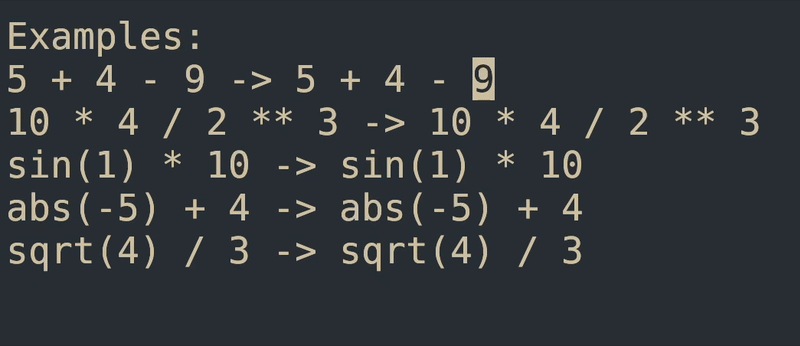

## calc.nvim: A Calculator in NeoVim

Inspired by [vim-calc](https://github.com/theniceboy/vim-calc).

Uses [asteval](https://newville.github.io/asteval/) to perform *safe-ish* 
expression evaluations and replaces the expression right in your buffer!


#### Introduction
`calc.nvim` is a fully functional calculator that will replace expressions in your buffer
with their result!



#### Installation

Install `vimcalc` with [Lazy](https://github.com/folke/lazy.nvim):

```lua
require("lazy").setup({
    "lcford2/calc.nvim"
})
```

#### Usage

To bind to a key, add this to your `nvim` configuration:

```lua
vim.keymap.set("v", "<C-c>", "<cmd>Calculate<cr>", {})
```

Now, you can press `Control` and `c` to calculate!

#### License
MIT
